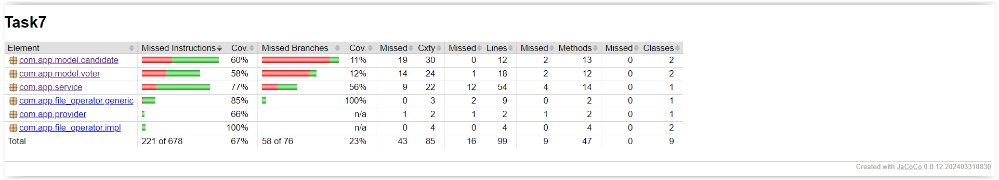

# Simple program imitating voting

The project allows for an election simulation in which voters vote for candidates from their constituency. The election results are analyzed to determine the winner. In the event of a tie, an additional round of voting is organized until a clear leader is selected.

## Technologies and libraries used

* Java
* Maven
* Lombok
* JUnit
* AssertJ

## Jacoco Coverage

